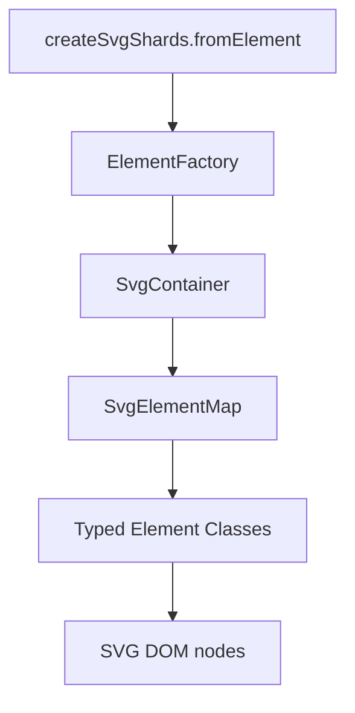

# Architecture Overview

## Layers

## Data flow

1. User passes any `HTMLElement` inside an SVG (or the `<svg>` itself)
2. `SvgShardsFactory` finds the root `<svg>` via `closest('svg')`
3. `ElementFactory.parseSvgElement` walks all descendants with `querySelectorAll('*')`
4. Each node is wrapped in a typed class and pushed into `SvgElementMap`
5. `SvgContainer` exposes grouped access, flat queries, and refresh

## Naming: svg-shards

| Name                      | Role                                 |
| ------------------------- | ------------------------------------ |
| `svg-shards`              | npm package name                     |
| `createSvgShards`         | Public factory entry point           |
| Shard                     | One independent SVG element instance |
| `@svg-shards/highlighter` | Optional highlight/viewport plugin   |

Chosen over `svg-particles` because that name is taken on npm and would conflict with particle-generation libraries.

## v1 design decisions

| Decision        | Choice              | Rationale                                           |
| --------------- | ------------------- | --------------------------------------------------- |
| Mutability      | In-place DOM writes | Simple, predictable, matches DOM mental model       |
| Element index   | Flat map by type    | Easy `elements.rect[0]` access; tree deferred to v2 |
| Group key       | `group` (not `g`)   | Readable API; mapped via `TAG_TO_MAP_KEY`           |
| Transform API   | String prepend      | Minimal v1; matrix math in roadmap                  |
| Browser support | DOM required        | No SSR; zero deps                                   |

## Plugin architecture

`plugins/svg-highlighter` depends on `svg-shards` and adds:

- `SvgHighlighter` — sequential/per-element highlight with style snapshot/restore
- `ViewportController` — zoom, pan, rotate on a wrapper (whole SVG, not per-shard)

The plugin uses core's `captureVisualState` / `applyHighlight` — no duplicate style logic.
